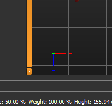

# MakeHuman Viewport & Navigation Plugins

A set of UI and navigation enhancements for the MakeHuman application to improve viewport control and spatial orientation.

## Features

This repository contains two separate plugins:

1. **Coordinate Axes Plugin**
   * Displays a 3D coordinate widget in the viewport to easily track the X, Y, and Z axes orientations.
   

2. **Navigation Cube Plugin**
   * Adds an interactive navigation cube (similar to Blender or CAD software).
   * Allows you to quickly rotate the viewport and snap to specific orthographic or isometric views (Front, Back, Top, Bottom, Left, Right) by clicking on the cube faces.


---

## Installation

To install the plugins, follow these simple steps:

1. Download or clone this repository.
2. Copy the plugin folders (**excluding** the `image` folder, if it is separate) into your MakeHuman plugins directory.
3. Restart MakeHuman.

### Installation Path:
```text
[Your Installation Path]\Makehuman-community\makehuman\plugins\
